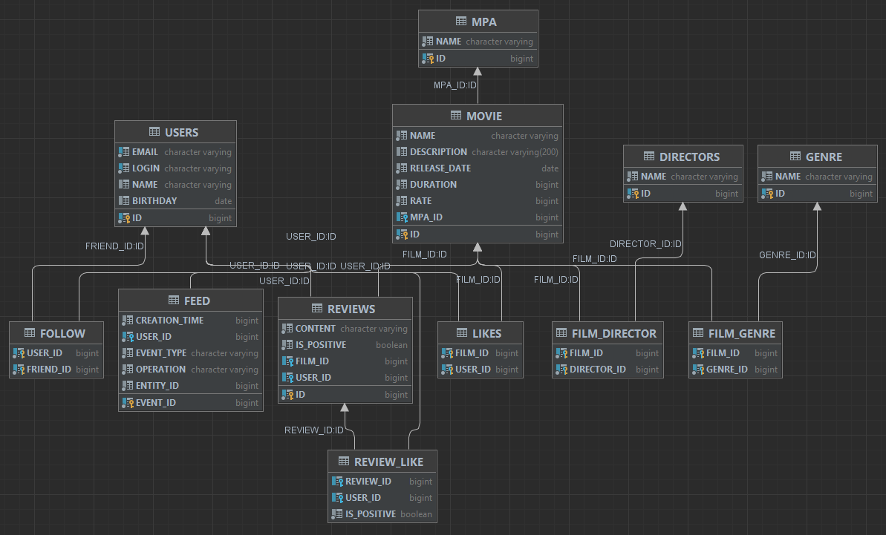

# Filmorate

Бэкенд сервиса для оценки фильмов

Добавлена новая функциональность:
-Функциональность  «Отзывы»
-Функциональность «Поиск»
-Функциональность «Общие фильмы»
-Функциональность «Рекомендации»
-Функциональность «Лента событий»
-Удаление фильмов и пользователей
-Добавление режиссёров в фильмы
-Вывод самых популярных фильмов по жанру и годам


<details>
  <summary>
    <h2>Устройство базы данных</h2>
  </summary>
  <p>

### Диаграмма БД

### Примеры запросов

#### Получить список всех пользователей:
```sql
SELECT * 
FROM USERS
LEFT JOIN FOLLOW ON (id = user_id)
```

#### Найти пользователя по id:
```sql
SELECT * 
FROM USERS
LEFT JOIN FOLLOW ON (id = user_id)
WHERE id = ?
```

#### Получить общих друзей:
```sql
SELECT friend_id
FROM FOLLOW
WHERE (user_id = ? OR user_id = ?)
GROUP BY friend_id
HAVING COUNT(friend_id) > 1
```

#### Получить фильм по id:
```sql
SELECT *
FROM MOVIE
WHERE id = ?
```

#### Получить первые N самых популярных фильмов:
```sql
SELECT id,
       name,
       COUNT(id)
FROM MOVIE
LEFT JOIN LIKES ON id = film_id
GROUP BY id
ORDER BY COUNT(id) DESC
LIMIT ?
```
  </p>
</details>
